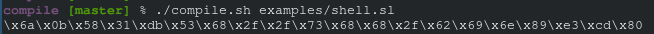

# what is this
`compile` generates usable x86 shellcode from a programming language with python-style syntax, using yet another messy python script.



the shellcode generated by the script meets some requirements:
* contains no null bytes
* contains no hardcoded memory addresses
* is as small and optimized as possible

# usage
```
./compile.sh <file>
```

run the above command, and it will output the x86 shellcode in `\xff\x...` format.

the standard file extension for this language is `.sl` (-> simple/shellcoding language).

# examples
i put a few example sl scripts in the `examples/` directory

# bugs
feel free to make a pr, but i won't be actively developing the project anymore or fixing bugs

# docs
i haven't written any docs, but really quickly, here are the constants:
```
stdin = 0
stdout = 1
stderr = 2
o_rdonly = 0b0
o_creat = 0b100
o_trunc = 0b1000
```

if you want documentation for the default syscalls/functions, in the `compile.py` file, ctrl+f for `syscalls = {`.

# fun facts
* i wrote this entire thing during a few periods of my computer science class when i was a hs sophomore (2017-18)
* i've updated this script a lot and added a ton of new features, but will not be releasing the newer version
* i had only learned python a few months before writing this script, that's why it's so messy (and because i was not planning on releasing it)
